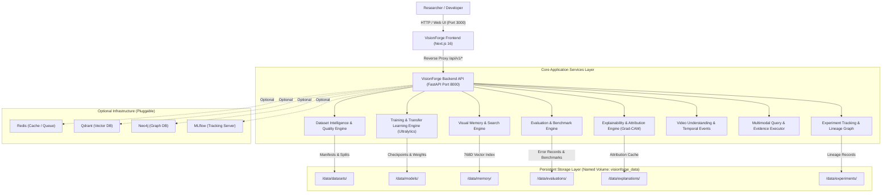

# VisionForge System Architecture & Service Map

---

## 1. System Overview

VisionForge is a research-oriented computer vision platform engineered for dataset intelligence, transfer learning model training, multi-metric benchmarking, diagnostic error analysis, Grad-CAM explainability, and reproducible experiment lineage tracking.

---

## 2. Service Map & Component Matrix

| Service / Subsystem | Required / Optional | Runtime Technology | Default Port | Internal Endpoint | Responsibility |
| :--- | :--- | :--- | :--- | :--- | :--- |
| **Frontend** | **Required** | Next.js 16, React 19, TailwindCSS v4 | `3000` | `http://frontend:3000` | Responsive researcher workbench UI, interactive visualizations, and API proxy rewrites. |
| **Backend API** | **Required** | FastAPI, Python 3.11, PyTorch 2.x, Uvicorn | `8000` | `http://backend:8000` | REST API, lifecycle orchestrator, data validation, inference, and evaluation algorithms. |
| **Dataset Intelligence** | **Required** | NumPy, Pillow, Scikit-learn | Embedded | N/A | Dataset health scorecard, pre-split validation, label geometry checks, and leakage detection. |
| **Training Engine** | **Required** | Ultralytics YOLO & RT-DETR | Embedded | N/A | Transfer learning, learning rate schedulers, metrics snapshots, and checkpoint serialization. |
| **Model Registry** | **Required** | Python File Manager | Embedded | N/A | Immutable model version packaging, metadata registration, and dependency tracking. |
| **Evaluation & Benchmark** | **Required** | NumPy, PyTorch, Scikit-learn | Embedded | N/A | Confusion matrices, per-class PR curves, failure sample clustering, and runtime telemetry. |
| **Explainability Engine** | **Required** | PyTorch Grad-CAM, NumPy | Embedded | N/A | Convolutional attribution heatmaps, target bounding box concentration scoring. |
| **Visual Memory Index** | **Required** | NumPy Cosine Vector Matrix | Embedded | N/A | 768-dimensional dense visual feature indexing and sub-millisecond similarity retrieval. |
| **Persistent Volume** | **Required** | Docker Volume (`visionforge_data`) | N/A | `/data` | Host-independent disk persistence for datasets, model checkpoints, and telemetry. |
| **Redis** | *Optional* | Redis 7 Alpine | `6379` | `redis://redis:6379` | Distributed job queuing and task results caching (falls back to thread-safe in-memory queue). |
| **Qdrant** | *Optional* | Qdrant v1.9.0 | `6333` | `http://qdrant:6333` | External scale-out vector database (falls back to native `VisualMemoryIndex`). |
| **Neo4j** | *Optional* | Neo4j Community | `7687` | `bolt://neo4j:7687` | External graph database (falls back to native file-backed `LineageGraph`). |
| **MLflow** | *Optional* | MLflow Server | `5000` | `http://mlflow:5000` | External experiment tracking (falls back to native `ExperimentService`). |

---

## 3. Data Flow & Network Isolation

1. **Browser Client $\rightarrow$ Frontend**: The user accesses `http://localhost:3000`. All web pages and dashboard components render client-side or static-side via Next.js.
2. **Frontend $\rightarrow$ Backend**: Client fetch requests call relative routes (e.g. `/api/v1/datasets`, `/api/v1/health`). Next.js standalone server reverse-proxies these requests internally to `http://backend:8000/api/v1/*` through Docker bridge network (`visionforge_net`).
3. **Backend $\rightarrow$ Storage**: Backend writes and reads datasets, model checkpoints, and experiment lineage to the mounted `/data` volume.
4. **Security Isolation**: Only port `3000` (Frontend) and port `8000` (Backend API) are published to the host machine. Databases or external services run on the internal Docker network without public ingress exposure.

---

## 4. Hardware Portability & Architecture Invariants

- **CPU / Apple Silicon / NVIDIA CUDA**: VisionForge automatically detects hardware capabilities (`DEFAULT_DEVICE=auto`). It executes cleanly on CPU/MPS out of the box without requiring NVIDIA GPU hardware.
- **Decoupled Training**: Lightweight transfer-learning runs execute locally in seconds; large-scale distributed training can be dispatched to remote Google Colab or cloud GPU instances via `scripts/train_colab.py`.
- **Zero Lock-In**: Optional infrastructure (PostgreSQL, Redis, Qdrant, Neo4j, MLflow) is completely pluggable and never blocks startup when absent.
