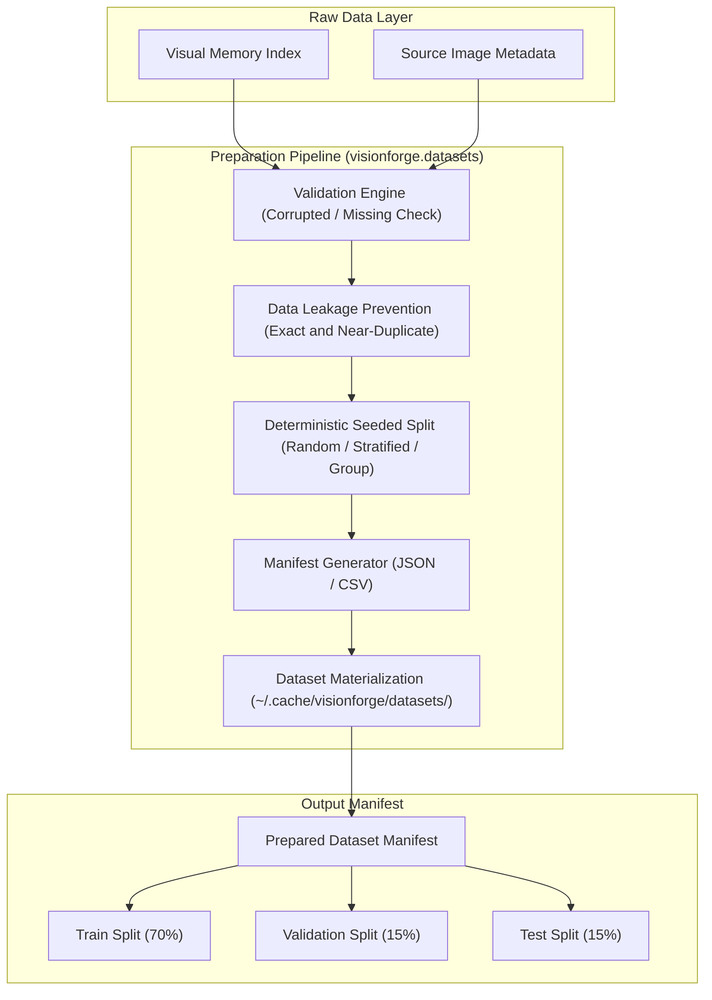

# VisionForge Dataset Preparation Pipeline

The VisionForge **Dataset Preparation Pipeline** provides reproducible, deterministic, and data-leakage-free dataset partitioning (`Train` / `Validation` / `Test`) for computer vision model training.

---

## 1. Architectural Overview

---

## 2. Data Leakage Prevention Engine

Train-test data contamination invalidates ML benchmark results. VisionForge prevents leakage across partitions using a dual-tier approach:

### 1. Exact Duplicate Hashing
- **Hash Algorithm:** SHA-256 over image byte stream or content metadata signature (`file_size_bytes`, `width`, `height`).
- **Policy:** Identical content hashes are grouped into `leak_exact_...` leakage clusters.

### 2. Near-Duplicate Embedding Cosine Similarity
- **Vector Space:** SigLIP 768-dimensional vision embeddings ($\mathbb{R}^{768}$).
- **Cosine Threshold:** $\ge 0.92$ similarity score.
- **Leakage Grouping:** All members of a near-duplicate cluster are assigned together into the SAME split partition (e.g. all in TRAIN), preventing training data from leaking into test validation metrics.

---

## 3. Split Strategies & Reproducibility

- **Random Seed Partitioning:** Enforces 100% determinism. Running the pipeline with identical parameters and random seed ($42$) yields identical split assignments.
- **Stratified Split:** Preserves class-label distributions across Train, Validation, and Test splits.
- **Group-Aware Split:** Keeps samples sharing metadata group keys in the same partition.

---

## 4. Manifest Specification & Storage Optimization

The generated `DatasetPreparationManifest` (`manifest.json` / `manifest.csv`) contains:
- `preparation_id`
- `dataset_id` & `dataset_version`
- `random_seed` & `split_config`
- `software_version`
- `samples` (sample ID, assigned split, content hash, dimensions, format, tags, leakage group ID)

**Storage Strategy:** Manifests reference source image records and hashes rather than duplicating gigabytes of binary data on disk.

---

## 5. REST API Endpoints

| Method | Endpoint | Description |
| :--- | :--- | :--- |
| `POST` | `/api/v1/datasets/prepare` | Execute preparation run & generate splits |
| `GET` | `/api/v1/datasets/prepare/history` | List historical preparation runs |
| `GET` | `/api/v1/datasets/prepare/{prep_id}` | Retrieve preparation run details & validation report |
| `GET` | `/api/v1/datasets/prepare/{prep_id}/manifest` | Export dataset manifest (JSON / CSV) |
