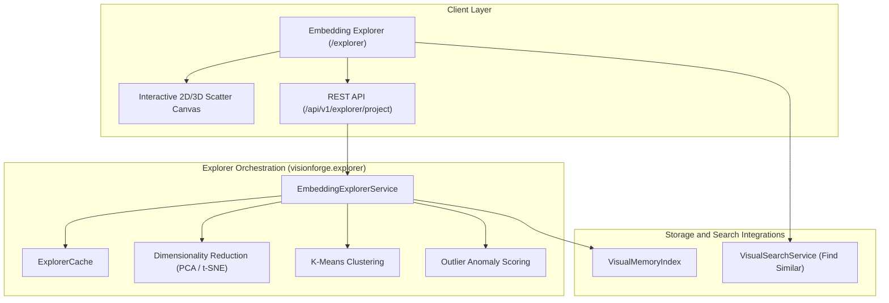

# VisionForge Embedding Explorer Architecture

The VisionForge **Embedding Explorer** provides interactive 2D and 3D visual space projection, K-Means clustering, and anomaly outlier detection for high-dimensional image embedding vectors stored inside `VisualMemoryIndex`.

---

## 1. Architectural Overview

---

## 2. Dimensionality Reduction Algorithms

### High-Dimensional Projection Problem
Image embeddings produced by Vision Transformers (`siglip-base-patch16-224`) exist in a 768-dimensional vector space ($\mathbb{R}^{768}$). Humans cannot directly perceive 768 dimensions. Dimensionality reduction maps these vectors onto a 2D ($\mathbb{R}^2$) or 3D ($\mathbb{R}^3$) visual space while preserving relative distances and visual cluster topologies.

### 1. Principal Component Analysis (PCA)
- **Mathematical Principle:** Linear orthogonal transformation identifying directions of maximum variance (eigenvectors of the covariance matrix).
- **Explained Variance Ratio:** Quantifies the proportion of global dataset variance captured by each principal component (e.g. PC1: 42.1%, PC2: 18.5%, Total: 60.6%).
- **Characteristics:** Global, deterministic, computationally fast ($O(N \cdot D^2)$), and preserves global variance structures.

### 2. t-Distributed Stochastic Neighbor Embedding (t-SNE)
- **Mathematical Principle:** Non-linear probabilistic technique converting Euclidean distances between data points into conditional probabilities that represent similarities.
- **Perplexity Hyperparameter:** Smooth measure of the effective number of neighbors ($5.0 \dots 50.0$).
- **Characteristics:** Local structure preservation, excels at revealing tight non-linear clusters and dataset sub-groups.

---

## 3. Clustering & Outlier Anomaly Detection

### K-Means Clustering
- Partitions projected points into $K$ distinct clusters ($K \ge 1$).
- Calculates cluster centroids $\boldsymbol{\mu}_k$, cluster sizes, and inertia (total sum of squared distances).

### Outlier Anomaly Scoring
- **Euclidean Centroid Distance:** $d(\mathbf{x}_i, \boldsymbol{\mu}_{c_i}) = \|\mathbf{x}_i - \boldsymbol{\mu}_{c_i}\|_2$.
- **Min-Max Score Normalization:**
  $$\text{OutlierScore}_i = \frac{d_i - d_{\min}}{d_{\max} - d_{\min} + 10^{-8}} \in [0.0, 1.0]$$
- Points with outlier scores $\ge 0.5$ are rendered with pulsing rose halos on the interactive visual canvas.

---

## 4. Local Caching & Performance

- **Cache Signature:** Hashes dataset state, method (`pca`/`tsne`), target components ($2$ or $3$), perplexity, random seed, and cluster count into SHA-256 keys.
- **Memory Efficiency:** Returns lightweight coordinate points ($x, y, z$) and metadata payload without transferring heavy raw float32 vectors over HTTP.

---

## 5. Direct Integration with Visual Search

When a user selects any projected point on the Visual Map Canvas, clicking **"Find Visually Similar Images"** delegates directly to `VisualSearchService.search_by_record()`, utilizing VisionForge's existing similarity search pipeline without code duplication.

---

## 6. Reproducibility & Future Roadmap

- **Reproducibility:** Every generated exploration records random seeds, timestamps, variance ratios, and hyperparameter logs.
- **Future UMAP Roadmap:** The `compute_projection()` interface is designed to support UMAP (Uniform Manifold Approximation and Projection) as an additional non-linear reduction algorithm in future releases.
