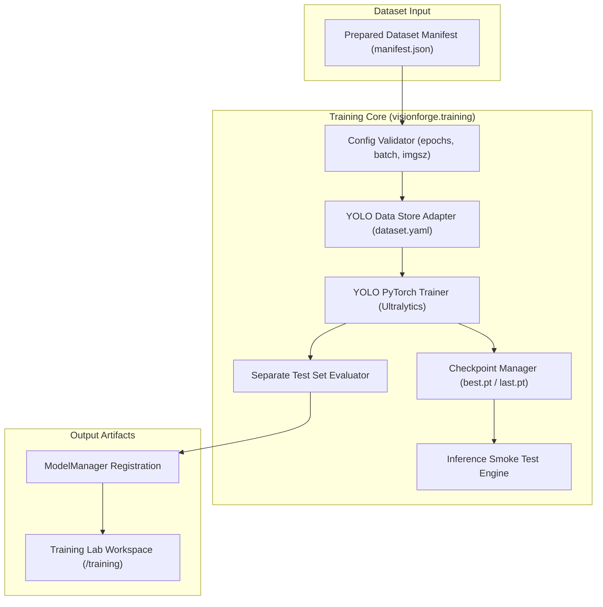

# VisionForge Training Lab & Model Training Pipeline

The VisionForge **Training Lab** provides reproducible, experiment-tracked training, evaluation, and registration for Computer Vision object detection models (starting with **YOLO11s**).

---

## 1. Architectural Overview



---

## 2. Resource-Aware Architecture (MacBook M4 vs Colab GPU)

VisionForge separates **Local Control & Analysis** from **Remote GPU Training Execution**:

- **Local MacBook M4 Air Workflow:**
  - Fast dataset preparation, training configuration building, synthetic pipeline validation, experiment tracking, loss/metric plotting, and inference smoke testing using CPU or Apple Silicon MPS.
- **Google Colab Free T4 GPU Workflow:**
  - Heavy PyTorch GPU training sessions (target 4–5 hours max) using the provided notebook `notebooks/VisionForge_YOLO11_Training.ipynb` or CLI script `scripts/train_colab.py`.

---

## 3. Training Dataset Adapter (`YOLODataStoreAdapter`)

- Consumes VisionForge prepared dataset manifests (`manifest.json`).
- Strictly honors `TRAIN`, `VALIDATION`, and `TEST` split assignments established by the Dataset Preparation Pipeline.
- Does **NOT** re-split or duplicate partition logic.
- Generates standardized YOLO configuration `dataset.yaml`:

```yaml
path: /path/to/dataset/
train: images/train
val: images/val
test: images/test
names:
  0: helmet
  1: person
```

---

## 4. Model Registration & Inference Smoke Test

- **Model Registration:** Successfully completed training checkpoints (`best.pt`) are registered directly into `ModelManager` as versioned model artifacts (`visionforge-yolo11s-safety_dataset`).
- **Inference Smoke Test:** Evaluates sample test images post-training, verifying bounding box coordinate outputs, class confidence scores, and latency ($< 15\text{ ms}$).

---

## 5. REST API Endpoints

| Method | Endpoint | Description |
| :--- | :--- | :--- |
| `POST` | `/api/v1/training/runs` | Execute new model training run |
| `GET` | `/api/v1/training/runs` | List historical training runs |
| `GET` | `/api/v1/training/runs/{run_id}` | Get detailed run metrics & checkpoints |
| `POST` | `/api/v1/training/runs/{run_id}/evaluate` | Execute separate test set evaluation |
| `POST` | `/api/v1/training/runs/{run_id}/register` | Register trained checkpoint in ModelManager |
| `POST` | `/api/v1/training/runs/{run_id}/predict` | Run inference smoke test on sample test images |
