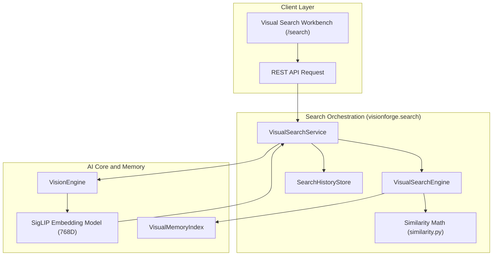

# VisionForge Visual Memory & Visual Similarity Search Architecture

The VisionForge **Visual Memory System** and **Visual Search Engine** provide dense vector indexing, disk storage persistence, similarity mathematics, search history telemetry, and a research-grade search workspace.

---

## 1. Architectural Overview

---

## 2. Cosine Similarity & Mathematics

### Why Cosine Similarity?
Image embeddings produced by Vision Transformers (such as `siglip-base-patch16-224`) represent high-dimensional semantic feature orientations in $\mathbb{R}^{768}$.

1. **Orientation vs. Magnitude:** Cosine similarity measures the cosine of the angle $\theta$ between two vectors, capturing semantic visual concepts independent of image contrast or scaling:
   $$\text{CosineSimilarity}(\mathbf{u}, \mathbf{v}) = \frac{\mathbf{u} \cdot \mathbf{v}}{\|\mathbf{u}\|_2 \|\mathbf{v}\|_2 + \epsilon}$$
2. **$L_2$-Normalized Vectors:** Since VisionForge $L_2$-normalizes all stored embedding vectors ($\|\mathbf{u}\|_2 = 1.0$), Cosine Similarity simplifies to the matrix dot product ($\mathbf{u} \cdot \mathbf{v}$), bounded in $[-1.0, 1.0]$.
3. **Numerical Safety:** An $\epsilon = 10^{-12}$ floor prevents division-by-zero errors when evaluating zero vectors or malformed inputs.

---

## 3. Visual Search Engine (`visionforge.search`)

### Top-K & Threshold Filtering Algorithm
1. **Feature Extraction:** Query image is passed through `VisionEngine` $\rightarrow$ `SigLIPEmbeddingModel` $\rightarrow$ 768D float32 vector.
2. **Matrix Dot Product:** Vectorized NumPy multiplication evaluates query vector $\mathbf{q}$ against candidate matrix $\mathbf{M} \in \mathbb{R}^{N \times 768}$.
3. **Descending Sort:** Candidate indices are sorted in descending order of similarity score.
4. **Threshold Cutoff:** Candidate matches below `threshold` (e.g. $0.5$) are filtered out.
5. **Top-K Selection:** Top $K$ matches are populated with metadata and returned.

### Search History Telemetry
- Each search transaction generates a unique `search_id` (`srch_...`).
- Logs execution time breakdown:
  - `embedding_time_ms`: Duration to generate 768D query embedding via PyTorch/ONNX.
  - `search_time_ms`: Duration to compute vector similarity across indexed visual memory.
  - `total_execution_time_ms`: End-to-end query latency.
- Records are stored in `SearchHistoryStore` and synced to disk JSON at `~/.cache/visionforge/history/search_history.json`.

---

## 4. REST API Reference

### Memory Subsystem (`/api/v1/memory`)
- `POST /api/v1/memory/index` — Upload image file $\rightarrow$ extract SigLIP embedding $\rightarrow$ index in Visual Memory.
- `GET /api/v1/memory/stats` — Return index telemetry (record count, dimension, RAM size MB).
- `GET /api/v1/memory/records` — Return paginated list of indexed visual memory records.
- `DELETE /api/v1/memory/clear` — Purge all indexed vectors from memory and disk.

### Search Subsystem (`/api/v1/search`)
- `POST /api/v1/search/image` — Upload query image file $\rightarrow$ execute similarity search.
- `POST /api/v1/search/record` — Execute similarity search using an existing Visual Memory record ID as query.
- `POST /api/v1/search/vector` — Execute similarity search using raw 768D query vector.
- `GET /api/v1/search/history` — Return historical search execution logs.

---

## 5. Current Limitations & Scale Roadmap

- **Current Implementation:** Local in-memory matrix multiplication using NumPy (`np.dot`). Suitable for up to ~100,000 vectors with sub-millisecond query latencies.
- **Future Vector Indexing Strategy:** When scale exceeds 100K+ vectors, `VisualMemoryIndex` can be upgraded with HNSW (Hierarchical Navigable Small World) or IVF-PQ graph indices (FAISS / Qdrant) without breaking the `VisualSearchService` interface.
