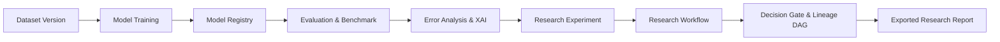

# VisionForge End-to-End Integration Testing & Validation Specification

---

## 1. Overview & Verification Philosophy
The **VisionForge Integration Test Suite** provides exhaustive, deterministic validation of the complete computer vision research lifecycle. It guarantees that individual subsystems—Dataset Preparation, Dataset Intelligence, Model Training, Model Registry, Benchmarking, Error Analysis, Explainability, Visual Search, Video Intelligence, Vision-Language Querying, Research Workflows, and Lineage Tracking—operate harmoniously without data corruption, state drift, or unhandled exceptions.



---

## 2. The Golden Path Lifecycle

The golden path (`backend/tests/test_end_to_end_golden_path.py`) executes the following sequential steps:

1. **Dataset Preparation & Splitting (`POST /api/v1/datasets/prepare`)**:
   - Materializes deterministic train/val/test splits (70/15/15) with isolated label manifests and metadata hashes.
2. **Dataset Intelligence & Health Audit (`GET /api/v1/datasets/intelligence/profile`, `/health`)**:
   - Computes category class distributions, bbox area ratios, and dataset integrity checks.
3. **Training Run Execution (`POST /api/v1/training/runs`)**:
   - Executes real lightweight Ultralytics PyTorch training iterations with live telemetry logging and best checkpoint extraction.
4. **Model Registration (`POST /api/v1/training/runs/{id}/register`)**:
   - Packages trained weights into the versioned `ModelManager` registry with semantic version tags and hardware metadata.
5. **Model Evaluation & Failure Gallery (`POST /api/v1/evaluation/runs`, `GET /failures`)**:
   - Executes benchmark evaluation against isolated test splits; computes mAP@50, precision, recall, and extracts visual failure samples.
6. **Explainability Heatmap Generation (`POST /api/v1/explainability/explanations`)**:
   - Generates Grad-CAM visual activation heatmaps with object concentration scoring.
7. **Controlled Research Experiment (`POST /api/v1/experiments/research`, `/variants`, `/runs`)**:
   - Locks evaluation protocol, links Baseline (YOLO11n) vs. Variant (YOLO11s), runs multi-trial evaluations, and computes metric deltas ($\Delta$ mAP50).
8. **Research Workflow Orchestration (`POST /api/v1/workflows/`, `/start`, `/advance`, `/decisions`)**:
   - Moves through the 8-stage state machine (`RESEARCH_DEFINITION` $\rightarrow$ `REPORT`) and passes human decision gates (`ACCEPT`).
9. **Traceable Research Report & Lineage Export (`GET /api/v1/workflows/{id}/export`)**:
   - Exports immutable lineage DAGs with cryptographic reproducibility checksums.

---

## 3. Subsystem Integration Coverage

| Subsystem | Integration Test Function | Endpoints / Components Covered |
| :--- | :--- | :--- |
| **Complete Golden Path** | `test_golden_path_full_research_lifecycle` | `/datasets`, `/training`, `/models`, `/evaluation`, `/explainability`, `/experiments/research`, `/workflows` |
| **Fault Resilience & Error Handling** | `test_training_failure_and_safe_recovery` | Invalid dataset configs, missing checkpoints, graceful HTTP 400/404/422 validation |
| **Human Decision Gates & Loops** | `test_state_machine_investigate_loop_and_rejection` | Human review gates, `INVESTIGATE` loop reset, `REJECT` termination, decision history audit |
| **Multimodal Vision-Language** | `test_vision_language_grounded_multimodal_answering` | Grounded spatial reasoning, bounding box extraction, safety gear compliance questions |
| **Concurrency & Idempotency** | `test_concurrency_and_idempotent_operations` | Concurrent read access, idempotent status calls, telemetry consistency under load |
| **System Observability & Health** | `test_observability.py` | Liveness `/health`, Readiness `/ready`, Dependency Matrix `/health/dependencies`, Prometheus metrics |

---

## 4. Test Execution Commands

```bash
# Run full automated backend test suite (242+ tests)
cd backend && uv run pytest -v

# Run golden path lifecycle test specifically
cd backend && uv run pytest tests/test_end_to_end_golden_path.py -v

# Run frontend type-check & build verification
cd frontend && npx tsc --noEmit && npm run build
```
