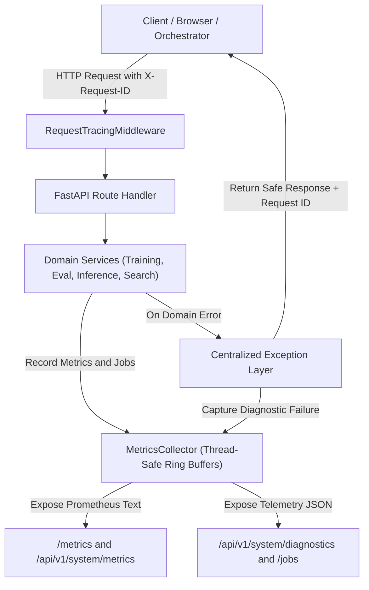

# VisionForge Observability, Health & Reliability Guide

---

## 1. Observability Overview

VisionForge provides a built-in, production-grade observability system designed to answer the core operational questions of computer vision research platforms:
- **What happened?** (Structured event & failure telemetry)
- **Where did it happen?** (Subsystem categorization: `training`, `evaluation`, `inference`, `search`, `storage`)
- **When did it happen?** (UTC ISO timestamps across all events)
- **Which request caused it?** (`X-Request-ID` correlation propagated through API, middleware, logs, and error responses)
- **Which workload was involved?** (`job_id` tracking for training, dataset prep, and evaluation runs)
- **How long did it take?** (Sub-millisecond request timing, inference latency, and job durations)
- **Did it succeed or fail?** (Standardized lifecycle states: `QUEUED`, `RUNNING`, `COMPLETED`, `FAILED`, `CANCELLED`)
- **Why did it fail?** (Diagnostic error codes and failure records)
- **Is the system healthy?** (Liveness `/health`, Readiness `/ready`, and Dependency Matrix `/health/dependencies`)



---

## 2. Health & Readiness Probes

VisionForge provides three distinct probe endpoints conforming to modern container orchestration standards:

| Endpoint | Probe Type | Purpose | Response Payload |
| :--- | :--- | :--- | :--- |
| `/health` | **Liveness** | Confirms backend process is alive. | `{"status": "ok", "service": "visionforge-backend", "version": "0.1.0"}` |
| `/ready` | **Readiness** | Confirms backend is ready to accept HTTP traffic and compute jobs (verifies storage directory write access, model registry load state, and device manager). | `{"ready": true, "status": "ready", "checks": {"storage_writable": true, ...}}` |
| `/api/v1/health/dependencies` | **Dependency Matrix** | Granular inspection of core subsystems and optional external integrations with graceful degradation. | Complete dependency health report (see below). |

### Dependency Status Codes:
- `HEALTHY`: Subsystem is fully operational and responsive.
- `DEGRADED`: Subsystem is functional but experiencing constraints (e.g. low storage headroom).
- `UNAVAILABLE`: Required core subsystem is non-responsive (returns HTTP 503).
- `DISABLED`: Optional external integration (e.g. PostgreSQL, Redis, Qdrant, Neo4j, MLflow, Cloud LLM keys) is intentionally unconfigured; core platform continues running without degradation.

---

## 3. Request Correlation & Tracing (`X-Request-ID`)

1. **Header Ingestion**: The `RequestTracingMiddleware` checks for an incoming `X-Request-ID` header. If absent, it automatically generates a UUIDv4 string.
2. **Context Propagation**: The `request_id` is bound to `request.state.request_id` and logged alongside HTTP method, path, status code, and latency:
   ```text
   [2026-08-18 17:50:07] INFO [visionforge.request] GET /api/v1/system/info -> 200 (1.45ms) [req_id=req_custom_tracer_999]
   ```
3. **Response Headers**:
   - `X-Request-ID`: Correlation identifier
   - `X-Process-Time`: Total processing duration in milliseconds (e.g. `1.45ms`)

---

## 4. Standardized Domain Error Codes

All API errors return a standard envelope containing the domain error code, human-readable message, request correlation ID, and optional diagnostic details. Stack traces are suppressed in production.

| Error Code | HTTP Status | Triggering Scenario |
| :--- | :--- | :--- |
| `DATASET_NOT_FOUND` | `404 Not Found` | Requested dataset ID or preparation manifest does not exist. |
| `MODEL_NOT_FOUND` | `404 Not Found` | Target model weight checkpoint or registry entry is missing. |
| `JOB_NOT_FOUND` | `404 Not Found` | Background workload identifier is not found in observatory. |
| `VALIDATION_ERROR` | `422 / 400` | Request parameters or body payload fail schema constraints. |
| `INVALID_DATASET` | `400 Bad Request` | Image files unreadable or bounding box coordinates out of bounds. |
| `INVALID_CONFIGURATION` | `400 Bad Request` | Invalid hyperparameters (e.g. batch size $<1$, learning rate $\le 0$). |
| `TRAINING_JOB_FAILED` | `500 Server Error` | Deep learning model training execution failure. |
| `EVALUATION_FAILED` | `500 Server Error` | Benchmark dataset evaluation failure. |
| `DEPENDENCY_UNAVAILABLE` | `503 Service Unavailable` | Required upstream service or database is unreachable. |
| `INTERNAL_SERVER_ERROR` | `500 Server Error` | Unhandled fallback server exception. |

### Standard Error Response Format:
```json
{
  "success": false,
  "data": null,
  "error": {
    "code": "DATASET_NOT_FOUND",
    "message": "Dataset with ID 'coco8_missing' was not found",
    "details": []
  },
  "meta": {
    "request_id": "req_84f93a1bc2"
  }
}
```

---

## 5. Background Job Observability & History

Background workloads (training runs, evaluations, dataset preparation, video processing) are tracked in the centralized `MetricsCollector`:

### Supported Job Lifecycle States:
$$\text{QUEUED} \longrightarrow \text{RUNNING} \longrightarrow \begin{cases} \text{COMPLETED} \\ \text{FAILED} \\ \text{CANCELLED} \end{cases}$$

### Job Query APIs:
- `GET /api/v1/system/jobs`: List recent and active background jobs with status, duration, progress percentage, and error summaries.
- `GET /api/v1/system/jobs/{job_id}`: Deep inspection of a specific job's metadata and execution history.
- `GET /api/v1/system/errors`: Ring-buffer of recent subsystem failures for immediate operational root-cause analysis.

---

## 6. Prometheus Operational Metrics Dictionary

VisionForge exposes real system metrics at `/metrics` and `/api/v1/system/metrics` formatted for Prometheus / Grafana scrapers:

| Metric Name | Type | Description |
| :--- | :--- | :--- |
| `visionforge_uptime_seconds` | Gauge | Total process runtime in seconds. |
| `visionforge_http_requests_total` | Counter | Total incoming HTTP API requests. |
| `visionforge_http_errors_total` | Counter | Total failed HTTP API requests ($4xx / 5xx$). |
| `visionforge_http_latency_avg_ms` | Gauge | Rolling average HTTP request latency in milliseconds. |
| `visionforge_http_latency_p95_ms` | Gauge | 95th percentile HTTP request latency in milliseconds. |
| `visionforge_jobs_active` | Gauge | Current number of actively running background workloads. |
| `visionforge_jobs_queued` | Gauge | Current number of queued background workloads. |
| `visionforge_jobs_failed_total` | Counter | Total count of failed background workloads. |
| `visionforge_cv_inferences_total` | Counter | Total deep learning model inferences executed. |
| `visionforge_cv_search_queries_total` | Counter | Total visual memory embedding search queries executed. |
| `visionforge_video_frames_processed_total` | Counter | Total video frames processed across temporal pipelines. |
| `visionforge_models_loaded` | Gauge | Number of loaded models currently in GPU/RAM memory cache. |

---

## 7. Developer Troubleshooting Runbook

When investigating an issue or unexpected behavior in VisionForge, follow this standard 8-step diagnostic workflow:

```text
Step 1: Check Liveness & Readiness
  → curl http://localhost:8000/health
  → curl http://localhost:8000/ready

Step 2: Inspect Dependency Health Matrix
  → curl http://localhost:8000/api/v1/health/dependencies

Step 3: Check Active & Recent Jobs
  → curl http://localhost:8000/api/v1/system/jobs

Step 4: Inspect Recent Failures Stream
  → curl http://localhost:8000/api/v1/system/errors

Step 5: Correlate via Request ID
  → Search container logs for [req_id=<id>]
  → docker compose logs backend | grep <request_id>

Step 6: Match Error Code
  → Check Domain Error Codes table above for root-cause guidance.

Step 7: Retry Safe Operation
  → If dataset or configuration validation failed, adjust parameters and re-submit.

Step 8: Restart Service if Degraded
  → docker compose restart backend
```
