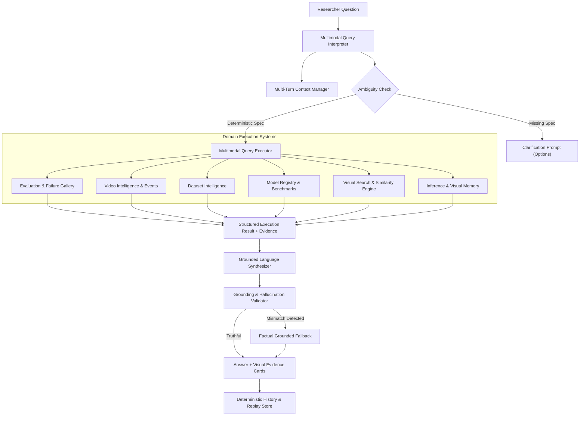

# VisionForge Multimodal Vision-Language Layer Architecture

## 1. Objective & Core Principle
The **VisionForge Multimodal Vision-Language Layer** bridges natural language and computer vision entities across images, videos, objects, tracks, temporal events, embeddings, dataset profiles, and model evaluations.

### Core Invariant:
> **"THE ANSWER MUST COME FROM ACTUAL VISION DATA."**
> Language models are not permitted to invent visual facts or hallucinations. Natural language queries are deterministically parsed into structured queries, executed against real domain subsystems, validated via strict grounding rules, and synthesized into evidence-backed answers.

---

## 2. Architectural Flow

---

## 3. Supported Query Categories

| Query Category | Example Questions | Target Domain Subsystem | Evidence Type |
|---|---|---|---|
| `FAILURE_QUERY` | "Show helmet failures with confidence below 0.50", "Why is sample 1024 considered a failure?" | `EvaluationService` & `FailureGallery` | `FAILURE_SAMPLE` |
| `DATASET_QUERY` | "How many samples are in the dataset?", "Show underrepresented classes in safety_v2" | `DatasetIntelligenceService` | `DATASET_PROFILE` |
| `MODEL_QUERY` | "Compare model yolo11s.pt and yolo11m.pt", "Which model performs best?" | `EvaluationService` & `BenchmarkService` | `MODEL_EVALUATION` |
| `EVENT_QUERY` | "Which objects entered Zone A?", "Which person stayed longer than 3s?" | `TemporalEventService` & `VideoLab` | `TEMPORAL_EVENT` |
| `TRACK_QUERY` | "Show trajectory and velocity for Track 1", "Fastest track in video" | `VideoIntelligenceService` | `TRACK_TRAJECTORY` |
| `VIDEO_QUERY` | "When did the first worker appear in video?", "Video overview" | `VideoIntelligenceService` | `VIDEO_TIMESTAMP` |
| `SEARCH_QUERY` | "Find images visually similar to sample 1024", "Search near duplicates" | `VisualSearchService` & `VisualMemory` | `SIMILAR_SAMPLE` |
| `IMAGE_QUERY` | "What objects are visible in this image?", "Show detected bounding boxes" | `InferenceService` | `DETECTION_BBOX` |
| `OBJECT_QUERY` | "Which detections have low confidence?", "Show highest confidence prediction" | `InferenceService` | `DETECTION_BBOX` |
| `EVALUATION_QUERY` | "What changed between these two model evaluations?", "Show mAP@50 metrics" | `EvaluationService` | `MODEL_EVALUATION` |

---

## 4. Grounding & Hallucination Protection
The `GroundingValidator` programmatically inspects generated answer text before returning it to the user:
1. **Numerical Grounding**: Extracts counts and metrics from the generated answer and validates that they strictly match `total_count` and raw counts in `execution_result`.
2. **Entity Grounding**: Verifies that any referenced `Track #...`, `evt_...`, `sample_...`, or model checkpoint names exist in the structured records.
3. **Automatic Fallback**: If a discrepancy or hallucination is detected, the validator rejects the candidate text and synthesizes a 100% deterministic, grounded answer directly from structured facts.

---

## 5. Multi-Turn Context & Conversational Memory
The `MultiTurnContext` manager tracks:
- `selected_dataset`, `selected_model`, `selected_video`, `selected_image`, `selected_time_range`
- `previous_query`: Allows conversational follow-up refinements (e.g. *Turn 1: "Show helmet failures"* $\rightarrow$ *Turn 2: "Only low confidence ones"* seamlessly merges `class_name="helmet"` with `max_confidence=0.50`).

---

## 6. Query Provenance, History & Replay
Every query execution generates:
- Unique `query_id` (`vq_...`)
- Cryptographic `reproducibility_hash` (SHA-256 over Query Type, Structured DSL, and Result count)
- Latency telemetry (`execution_time_ms`)
- Replay capability (`POST /api/v1/multimodal/queries/{query_id}/replay`)
