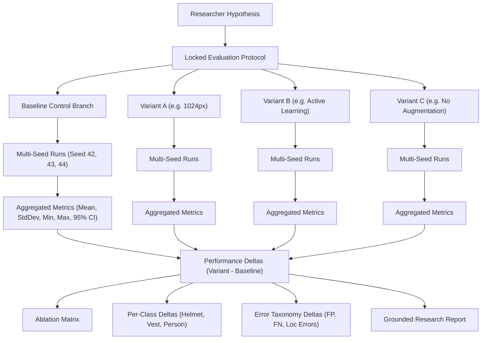

# VisionForge Research Benchmark, Ablation, & Experiment Lab Architecture

## 1. Objective & Core Principle
The **VisionForge Research Benchmark, Ablation, & Experiment Lab** answers the critical computer vision research question:
> *"Did this change actually improve the model?"*

### Core Invariant:
> **"EVERY RESEARCH CLAIM MUST BE TIED TO AN EXPERIMENT, DATASET, MODEL, CONFIGURATION, EVALUATION, AND REPLICATE METRICS."**
> The system enforces evidence-based conclusions, forbidding unsupported claims, fake statistical significance, and unverified hyperparameter assertions.

---

## 2. Research Experiment Architecture

---

## 3. Key Components & Invariants

### 1. Research Experiment & Protocol Lock
- `ResearchExperiment`: Combines hypothesis, baseline, variants, dataset version, locked evaluation protocol, and reproducibility metadata.
- **Protocol Lock**: The evaluation protocol (dataset split, primary metric, IoU threshold, confidence threshold, class handling) is locked upon experiment creation to prevent protocol drift.

### 2. Multi-Seed Replication & Descriptive Statistics
- For $N \ge 2$ seeds, the system calculates sample mean, Bessel-corrected standard deviation ($s = \sqrt{\frac{\sum (x_i - \bar{x})^2}{N - 1}}$), minimum, and maximum.
- For $N \ge 3$ seeds, calculates 95% confidence intervals via normal/t approximation ($\bar{x} \pm 1.96 \cdot \frac{s}{\sqrt{N}}$).
- For $N = 1$ run, strictly flags a **Single Run Warning**: *"Single run - Insufficient repeated runs for statistical inference."*

### 3. Variable Configuration Diff
- Field-level diff comparing Baseline vs. Variant parameters with component classification:
  - `augmentation`: Mosaic, mixup, HSV jittering
  - `resolution`: Image spatial resolution (640 vs 1024)
  - `active_learning`: Selection strategy and annotation budget
  - `architecture`: Model family, backbone, head
  - `dataset`: Dataset version and split partitions

### 4. Ablation Matrix
- Component presence matrix mapping system elements (`✓` / `✗`) to measured performance effects ($\Delta$ mAP@50).

### 5. Grounded Research Reports
- Synthesizes GitHub-flavored markdown documents with strictly grounded factual summaries, avoiding over-generalized statements.

---

## 4. Supported Research Experiment Paradigms

1. **Active Learning vs. Random Sampling Benchmark**:
   - Compares annotation efficiency: Random 5k vs. Active Learning 5k vs. Active Learning 2.5k (25% budget).
2. **Resolution & Augmentation Scaling Ablation**:
   - Measures impact of 640px vs. 1024px resolution against compute latency and small-object recall.
3. **Dataset Cleaning & Class Imbalance Study**:
   - Compares Dataset `v1.0` vs `v2.0` after deduplication and hard-sample review.
4. **Model Architecture Comparison**:
   - Compares YOLO11s (CNN) vs. RT-DETR (Transformer) under identical evaluation protocols.

---

## 5. REST API Reference

| Endpoint | Method | Purpose |
|---|---|---|
| `/api/v1/experiments/research` | `POST` | Create Research Experiment with locked protocol |
| `/api/v1/experiments/research` | `GET` | List all Research Experiments |
| `/api/v1/experiments/research/{id}` | `GET` | Retrieve complete Research Experiment details |
| `/api/v1/experiments/research/{id}/variants` | `POST` | Add controlled experimental variant branch |
| `/api/v1/experiments/research/{id}/variants/{var_id}/runs` | `POST` | Attach multi-seed evaluation run |
| `/api/v1/experiments/research/{id}/variants/{var_id}/diff` | `GET` | Retrieve Baseline vs. Variant parameter diff |
| `/api/v1/experiments/research/{id}/ablation` | `GET` | Retrieve component ablation study matrix |
| `/api/v1/experiments/research/{id}/research-report` | `GET` | Generate formal grounded research report |
