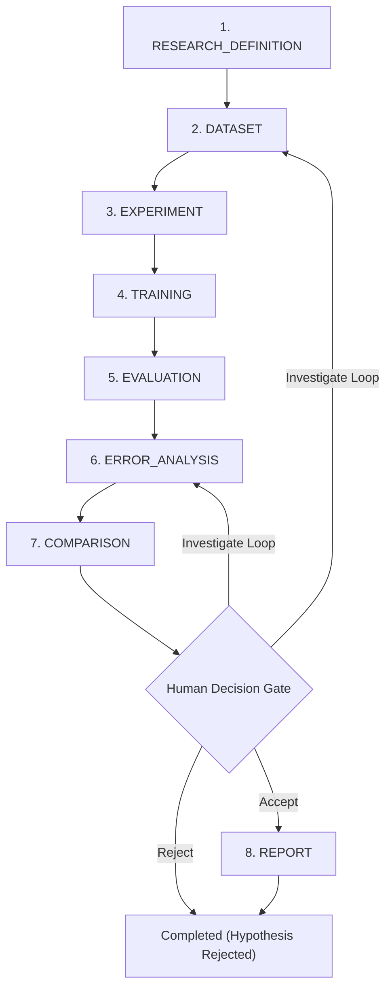

# VisionForge End-to-End Computer Vision Research Workflow Architecture

## 1. Objective & Core Principle
The **VisionForge Research Workflow System** provides a structured, reproducible, human-controlled orchestration layer for computer vision experiments.

### Core Philosophy:
> **"VisionForge is an orchestration and research-management layer, NOT an autonomous black-box AI."**
> Workflows remain **observable**, **reproducible**, **interruptible**, **auditable**, and **strictly human-controlled**.

---

## 2. The 8 Finite Workflow Stages

1. **`RESEARCH_DEFINITION`**: Specify research question, hypothesis, objective, success metrics (`map50`, `recall`), and constraints.
2. **`DATASET`**: Select dataset, dataset version, train/val/test splits, and lock protocol to guarantee zero data leakage.
3. **`EXPERIMENT`**: Attach `ResearchExperiment` linking baseline configuration and experimental branches.
4. **`TRAINING`**: Attach baseline and variant `TrainingRun`s with live status tracking (`Queued`, `Running`, `Completed`, `Failed`).
5. **`EVALUATION`**: Execute or attach `EvaluationRun`s evaluating checkpoints under locked evaluation protocol.
6. **`ERROR_ANALYSIS`**: Connect to `FailureGallery` and error taxonomy breakdowns (False Positives, False Negatives, Localization).
7. **`COMPARISON`**: Side-by-side metric comparison ($\Delta$ mAP) with the **Human Decision Gate** (`ACCEPT`, `REJECT`, `INVESTIGATE`).
8. **`REPORT`**: Synthesize grounded research report tracing specific run IDs, evaluation IDs, and metric deltas.

---

## 3. Human Decision Gate & Investigation Loop

At Stage 7 (`COMPARISON`), the researcher exercises scientific judgment:
- **`ACCEPT`**: Confirms experimental hypothesis and proceeds to `REPORT` stage.
- **`REJECT`**: Concludes workflow marking hypothesis as unsupported by empirical evidence.
- **`INVESTIGATE`**: Commences a new iteration cycle (`current_iteration += 1`), resets stage back to `ERROR_ANALYSIS` or `DATASET` for hard-negative analysis or data cleaning, while **preserving 100% of previous iteration history and lineage**.

---

## 4. Reusable Study Templates

1. **`ACTIVE_LEARNING_STUDY`**:
   - Initial Dataset $\rightarrow$ Baseline Training $\rightarrow$ Evaluation $\rightarrow$ Sample Selection $\rightarrow$ Human Review $\rightarrow$ Retrain $\rightarrow$ Compare.
2. **`BASELINE_VS_VARIANT`**:
   - Resolution & Augmentation scaling ablation against control baseline.
3. **`MODEL_ARCHITECTURE_COMPARISON`**:
   - CNN (YOLO11s) vs. Transformer (RT-DETR) evaluated under identical benchmark protocols.

---

## 5. REST API Reference

| Endpoint | Method | Description |
|---|---|---|
| `/api/v1/workflows` | `POST` | Create custom research workflow |
| `/api/v1/workflows/template` | `POST` | Instantiate workflow from template |
| `/api/v1/workflows` | `GET` | List all research workflows |
| `/api/v1/workflows/{id}` | `GET` | Retrieve complete workflow details |
| `/api/v1/workflows/{id}/start` | `POST` | Start workflow (`READY` $\rightarrow$ `RUNNING`) |
| `/api/v1/workflows/{id}/pause` | `POST` | Pause active workflow |
| `/api/v1/workflows/{id}/resume` | `POST` | Resume paused workflow |
| `/api/v1/workflows/{id}/cancel` | `POST` | Cancel workflow |
| `/api/v1/workflows/{id}/advance` | `POST` | Progress to next stage |
| `/api/v1/workflows/{id}/decisions` | `POST` | Record human decision gate (`ACCEPT`, `REJECT`, `INVESTIGATE`) |
| `/api/v1/workflows/{id}/notes` | `POST` | Attach observational note to stage |
| `/api/v1/workflows/{id}/lineage` | `GET` | Retrieve directed lineage DAG |
| `/api/v1/workflows/{id}/report` | `GET` | Synthesize traceable markdown report |
| `/api/v1/workflows/{id}/export` | `GET` | Export self-contained research package |
